# Final BEV Reconstruction Results Report

<span style="color:#2563eb;font-weight:700;">Project:</span> Cooperative masked BEV reconstruction using ego masked BEV + neighbor BEV.  
<span style="color:#2563eb;font-weight:700;">Report date:</span> 2026-04-23  
<span style="color:#2563eb;font-weight:700;">Main conclusion:</span> U-Net remains the strongest final baseline. Pix2Pix is a valid but weaker GAN comparison. Diffusion v3 is now a properly tested negative baseline.

## 1. Executive Checklist

<div class="checklist">

- [DONE] Built the 8-channel BEV reconstruction pipeline and fixed train / val / test protocol.
- [DONE] Tuned and locked the shared U-Net reconstruction loss with Optuna.
- [DONE] Completed the final U-Net 3-seed run.
- [DONE] Added thresholded visualization and split Occ-IoU into precision / recall / F1.
- [DONE] Diagnosed the U-Net limitation: false positives plus layer-wise information weakening.
- [DONE] Tested focal occupancy loss and layer-preserving U-Net probes; neither beat the official baseline.
- [DONE] Completed Pix2Pix smoke, full seed42 run, and adversarial-weight Optuna search.
- [DONE] Confirmed Pix2Pix best `lambda_adv = 0.1`; integer-scale weights such as `1.0` and `2.0` were worse.
- [DONE] Fixed Diffusion implementation with timestep conditioning and DDIM-style sampled evaluation.
- [DONE] Completed a fresh Narval A100 Diffusion v3 full run for 120 epochs.

</div>

## 2. Experiment Evolution

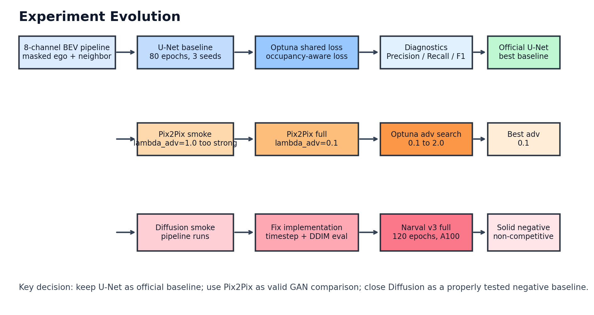

## 3. Training / Design Timeline

| Stage | What changed | Outcome |
| --- | --- | --- |
| U-Net initial | Baseline BEV reconstruction | Established task pipeline and first baseline |
| U-Net balanced / occupancy-aware | Added weighted L1 + masked MSE + occupancy BCE | Improved masked structure recovery |
| U-Net Optuna | Tuned shared loss weights | Final shared loss selected |
| U-Net 3 seeds | Ran seed 42/43/44, 80 epochs | Official baseline: masked Occ-IoU 0.1494 +/- 0.0023 |
| Threshold + diagnostics | Added thresholded visualization, precision / recall / F1 | Found U-Net recall is high but false positives remain |
| Focal U-Net ablation | Replaced occ BCE with focal occupancy loss | Did not beat baseline; rejected |
| Layer-preserving U-Net probes | Tried per-bin/height terms, then light height loss | Stable but did not clearly improve layer preservation; baseline kept |
| Pix2Pix smoke | Initial lambda_adv=1.0 | Adversarial term too strong |
| Pix2Pix full | Reduced lambda_adv=0.1 | Best Pix2Pix single-seed run completed |
| Pix2Pix Optuna | Searched lambda_adv from 0.1 to 2.0, including integer-scale weights | Confirmed lambda_adv=0.1; 1.0/2.0 underperformed |
| Diffusion smoke | Local low-memory smoke | Pipeline ran, but early result was not meaningful |
| Diffusion v1 cloud | 80 target but timed out around epoch 31, proxy eval and no timestep conditioning | Invalid as final comparison |
| Diffusion v2 | Added timestep conditioning and DDIM evaluation | Correct pipeline, still weak |
| Diffusion v3 final | Fresh Narval A100 run, 120 epochs, LR schedule, grad clipping | Completed; solid negative baseline |

## 4. Final Cross-Model Quantitative Comparison

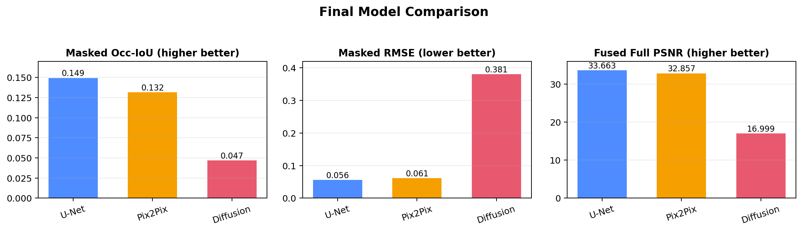

| Model | Seed(s) | Epochs | Final loss/objective | Masked Occ-IoU (higher better) | Masked RMSE (lower better) | Fused Full PSNR (higher better) | Status |
| --- | --- | --- | --- | --- | --- | --- | --- |
| U-Net | 42 / 43 / 44 | 80 | Shared reconstruction + occupancy loss | 0.1494 +/- 0.0023 | 0.05595 +/- 0.00010 | 33.66 +/- 0.02 | Best official baseline |
| Pix2Pix | 42 | 40 | 0.1 * adversarial + shared loss | 0.1317 | 0.06139 | 32.86 | Valid GAN comparison |
| Diffusion v3 | 42 | 120 | noise prediction + shared loss | 0.0467 | 0.38101 | 17.00 | Solid negative baseline |

## 5. Occupancy Diagnostics

These diagnostics explain why RMSE/PSNR alone are not enough. U-Net has the best main result, Pix2Pix is more conservative, and Diffusion predicts too much of the masked region as occupied.

| Model | Precision | Recall | F1 | Interpretation |
| --- | --- | --- | --- | --- |
| U-Net seed42 | 0.2002 | 0.3745 | 0.2609 | Higher recall, but visible false positives and layer weakening |
| Pix2Pix seed42 | 0.2701 | 0.2044 | 0.2327 | More conservative; precision higher, recall lower |
| Diffusion v3 seed42 | 0.0467 | 1.0000 | 0.0893 | Recall = 1.0, but precision collapses: predicts too much occupied area |

## 6. Final Loss Definitions

Common shared loss:

```text
L_shared =
  0.8082 * masked_weighted_L1
+ 0.1918 * masked_MSE
+ 0.2784 * masked_occ_BCE
```

Occupancy-related internal hyperparameters:

```text
occ_weight = 2.7594
occ_pos_weight = 8
occ_threshold = 0.07
occ_logit_temp = 0.03
```

Model-specific objectives:

```text
U-Net      : L_unet      = L_shared
Pix2Pix    : L_pix2pix    = 0.1 * L_adv + L_shared
Diffusion  : L_diffusion  = L_noise + L_shared
```

## 7. Final Qualitative Outputs

The following panels show six different test cases using the same final checkpoints. Each panel uses the same layout:
`Masked Ego | Ground Truth | U-Net | Pix2Pix | Diffusion v3`.

### Case 1

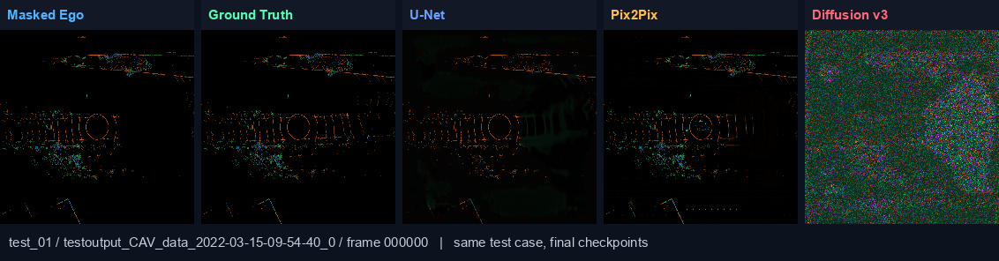

### Case 2

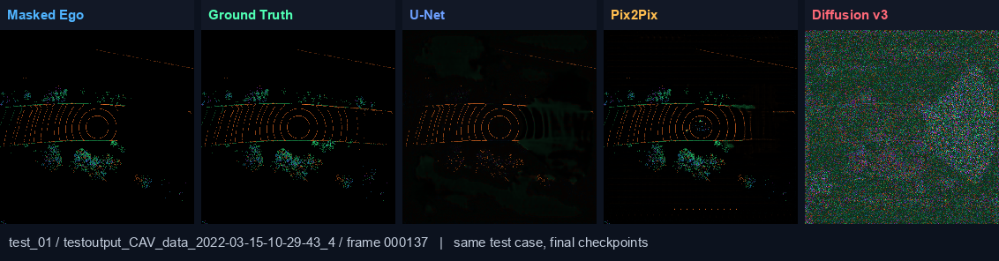

### Case 3

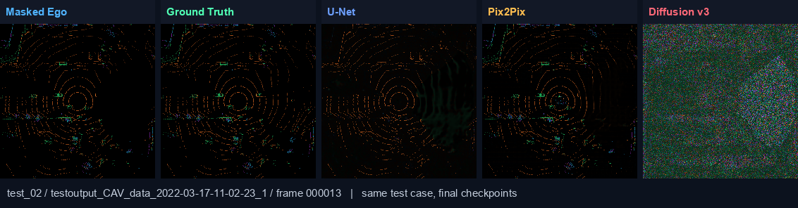

### Case 4

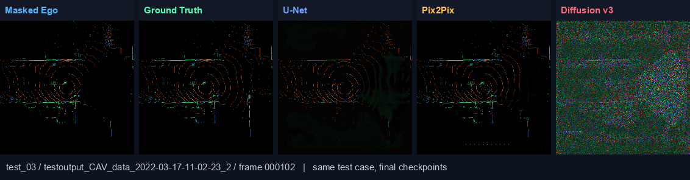

### Case 5

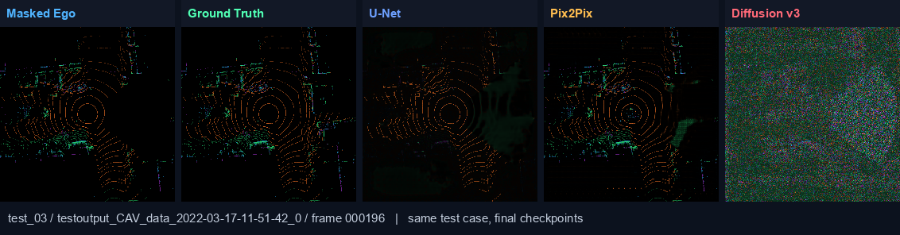

### Case 6

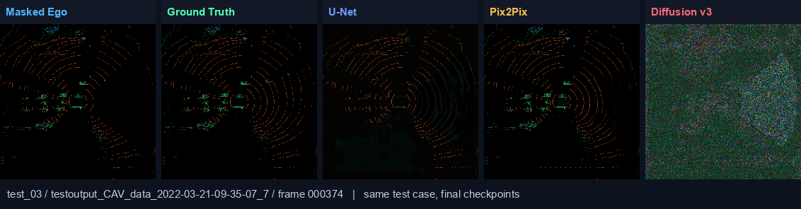

## 8. Per-Layer Reconstruction Views

The split view directly checks whether the model preserves the 8 BEV channels. `Abs Diff` means `|prediction - ground truth|`; brighter areas are larger per-layer errors.

### U-Net

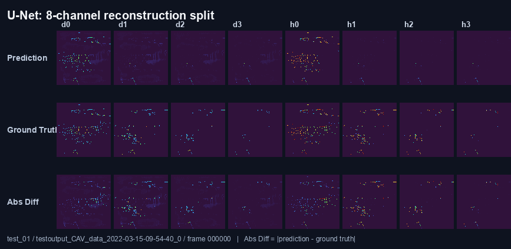

| Channel | Role | Masked MAE | Masked RMSE | Quality |
| --- | --- | --- | --- | --- |
| d0 | density | 0.01606 | 0.06083 | Acceptable |
| d1 | density | 0.01020 | 0.04366 | Acceptable |
| d2 | density | 0.00672 | 0.03126 | Good |
| d3 | density | 0.00436 | 0.01623 | Good |
| h0 | height | 0.01963 | 0.10967 | Weak |
| h1 | height | 0.00532 | 0.05940 | Acceptable |
| h2 | height | 0.00311 | 0.04272 | Acceptable |
| h3 | height | 0.00139 | 0.02743 | Good |

Judgement: U-Net layer recovery is usable but not perfect. Mean density RMSE = 0.03800, mean height RMSE = 0.05981, and the weakest channel is h0. This supports the diagnosis that U-Net preserves the main occupancy structure, but some layer-wise geometry, especially height-related structure, is weakened.

### Pix2Pix

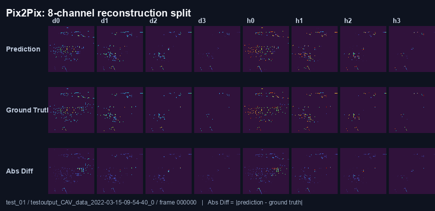

| Channel | Role | Masked MAE | Masked RMSE | Quality |
| --- | --- | --- | --- | --- |
| d0 | density | 0.01360 | 0.06358 | Acceptable |
| d1 | density | 0.00583 | 0.04523 | Acceptable |
| d2 | density | 0.00205 | 0.03095 | Good |
| d3 | density | 0.00073 | 0.01524 | Good |
| h0 | height | 0.02504 | 0.12274 | Weak |
| h1 | height | 0.00867 | 0.07223 | Acceptable |
| h2 | height | 0.00272 | 0.04279 | Acceptable |
| h3 | height | 0.00118 | 0.02746 | Good |

Judgement: Pix2Pix also loses layer detail. Mean density RMSE = 0.03875, mean height RMSE = 0.06631, and the weakest channel is h0. It is more conservative in occupancy, but that does not fully solve the layer-preservation issue.

### Diffusion v3

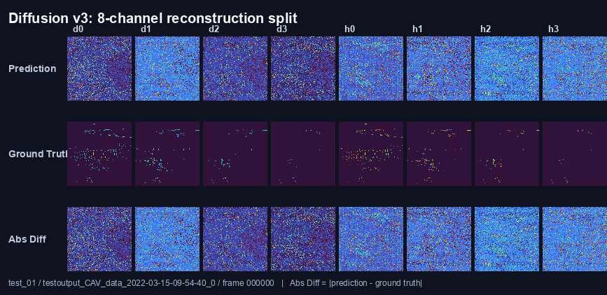

| Channel | Role | Masked MAE | Masked RMSE | Quality |
| --- | --- | --- | --- | --- |
| d0 | density | 0.21354 | 0.39561 | Poor |
| d1 | density | 0.30705 | 0.42800 | Poor |
| d2 | density | 0.22091 | 0.40037 | Poor |
| d3 | density | 0.21350 | 0.40029 | Poor |
| h0 | height | 0.24273 | 0.35705 | Poor |
| h1 | height | 0.28194 | 0.40864 | Poor |
| h2 | height | 0.21356 | 0.27739 | Poor |
| h3 | height | 0.26675 | 0.36020 | Poor |

Judgement: Diffusion v3 layer recovery is poor. Mean density RMSE = 0.40606, mean height RMSE = 0.35082, and the weakest channel is d1. The large per-layer errors confirm that Diffusion v3 does not preserve reliable 8-channel BEV structure.

## 9. Diffusion v3 Final Run

Diffusion v3 was the corrected full run:

- Narval A100 run.
- `seed = 42`.
- `epochs = 120`.
- `lr = 5e-5`, `min_lr = 5e-6`.
- `warmup_epochs = 2`.
- `grad_clip = 1.0`.
- `sample_steps = 25`.
- `val_every = 10`.
- timestep conditioning enabled.
- DDIM-style sampled validation/test enabled.

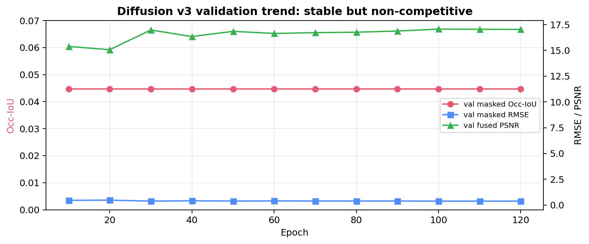

Final Diffusion v3 result:

```text
best epoch              = 30
test masked Occ-IoU     = 0.0467
test masked precision   = 0.0467
test masked recall      = 1.0000
test masked RMSE        = 0.3810
test fused full PSNR    = 17.00 dB
```

Interpretation: Diffusion v3 is no longer an invalid implementation run. It completed a full corrected 120-epoch training run, but the output occupancy collapses toward predicting too much occupied area. This gives recall `1.0`, but precision and Occ-IoU stay low. Therefore, it is a solid negative baseline rather than a competitive final model.

## 10. Final Conclusion

<div class="conclusion">

The final model ranking is clear:

1. **U-Net** is the official best baseline by masked Occ-IoU and RMSE.
2. **Pix2Pix** is a valid adversarial comparison, but it does not beat U-Net. Optuna confirmed that the small adversarial weight `0.1` is best.
3. **Diffusion v3** was properly corrected and fully trained, but it remains non-competitive. The main failure mode is over-predicting occupancy in the masked region.

</div>

## 11. Source Files

- U-Net 3-seed summary: `../01_unet_final/results/summary/unet_optuna_3seed_summary.json`
- U-Net seed42 diagnostics: `../01_unet_final/results/seed42/test_metrics_refresh.json`
- Pix2Pix summary: `../02_pix2pix_final/results/seed42/pix2pix_summary.json`
- Pix2Pix Optuna best params: `../02_pix2pix_final/configs/pix2pix_adv_best.json`
- Diffusion v3 summary: `../03_diffusion_final/results/seed42/diffusion_summary.json`
- Diffusion v3 history: `../03_diffusion_final/results/seed42/training_history.csv`

