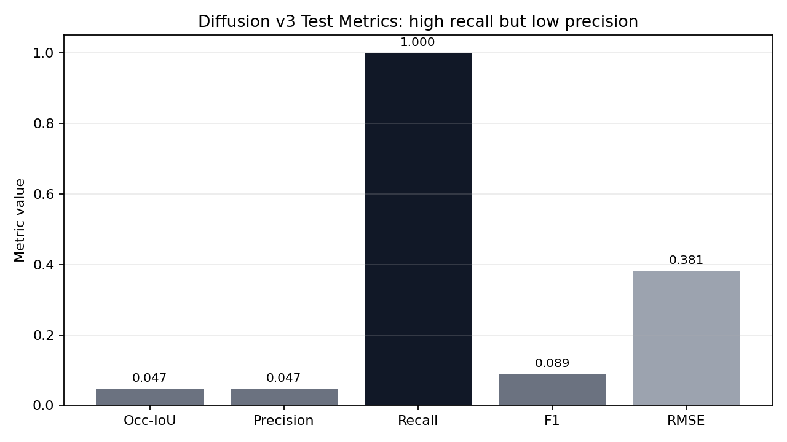
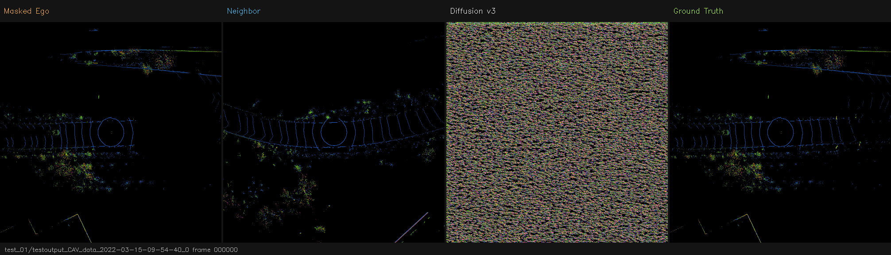
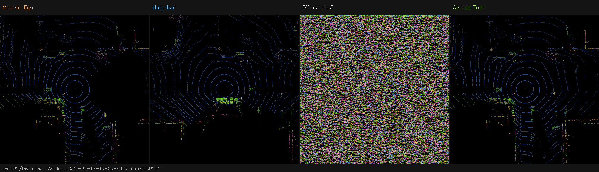
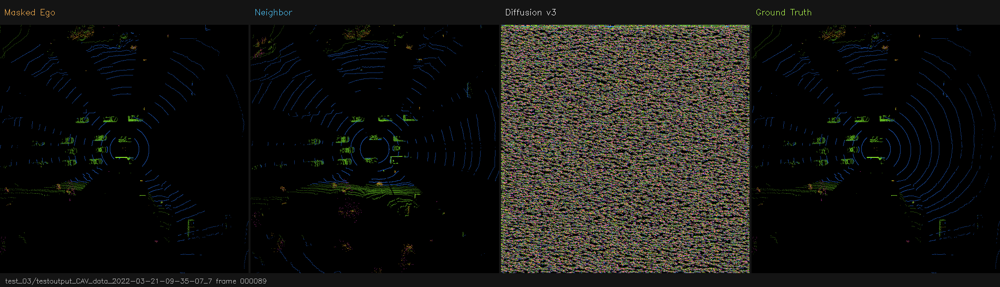
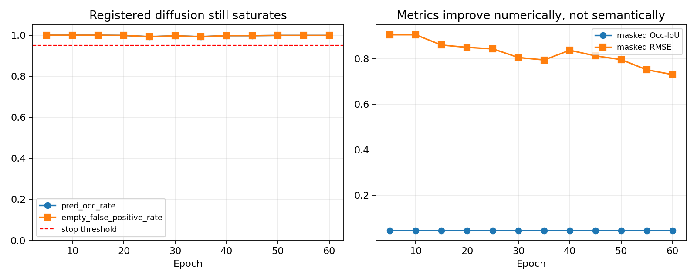
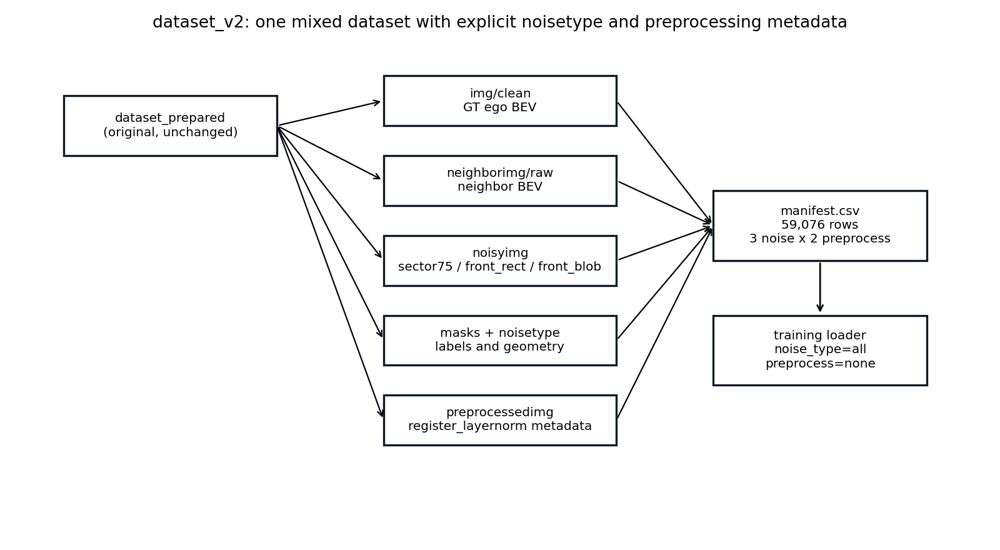
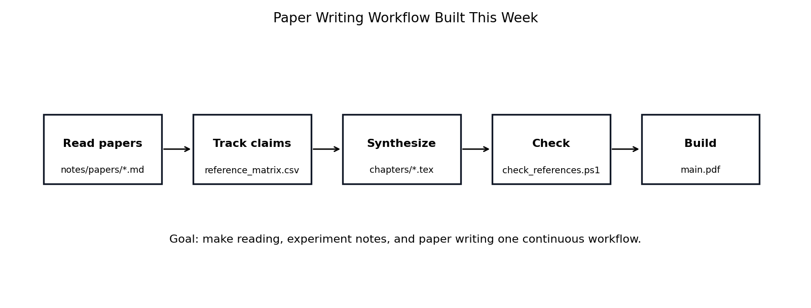

# Weekly Project Update: Diffusion Diagnosis and Dataset Redesign

**Date:** May 14, 2026  
**Project:** V2V BEV Reconstruction under Front-Region Sensor Occlusion

## 1. What I Led This Week

This week I moved the project from simply following model-level suggestions to making project-level decisions. The main shift was:

- I treated Diffusion as a scientific baseline instead of repeatedly forcing it to look good.
- I diagnosed why Diffusion failed using precision, recall, predicted occupancy rate, and empty false-positive rate.
- I redesigned the dataset protocol into a larger mixed-noise dataset with explicit `noisetype` and preprocessing metadata.
- I started mixed-noise U-Net and Pix2Pix training on Narval using the new `dataset_v2`.
- I built a paper-writing workflow so literature reading, notes, and thesis writing feed into each other.

The key conclusion is direct: **Diffusion is currently a negative baseline for this BEV reconstruction setup, while U-Net/Pix2Pix on the new mixed-noise dataset are now the next main experiments.**

## 2. Diffusion v3: Official Negative Baseline

Diffusion v3 was the first complete and reproducible Diffusion baseline. Compared with the earlier diffusion attempts, I fixed the training/evaluation protocol before judging it:

- Added timestep conditioning to the denoiser.
- Used real DDIM-style reverse sampling for validation/test instead of proxy evaluation.
- Added resume-safe checkpointing for Narval jobs.
- Used LR warmup + cosine decay and gradient clipping.
- Ran a full seed-42 Narval run for 120 epochs.

**Diffusion v3 test result:**

| Metric | Value | Meaning |
|---|---:|---|
| masked Occ-IoU | 0.0467 | Very low overlap with true occupied cells |
| masked precision | 0.0467 | Most predicted occupied cells are false positives |
| masked recall | 1.0000 | High only because it predicts almost everything occupied |
| masked F1 | 0.0893 | Low balanced occupancy score |
| masked RMSE | 0.3810 | Poor reconstruction magnitude |
| fused full PSNR | 17.00 dB | Full BEV looks better only because visible region is copied back |



**Interpretation:** v3 is not just a little weak. It has a clear failure mode: high recall with very low precision means it predicts too much occupied space in the hidden region.

### Diffusion v3 Visual Evidence

These examples show why the numerical result is not enough by itself: the generated hidden region is noisy / over-occupied and does not recover clean multi-layer BEV structure.








## 3. Registered / Pre-Layer Diffusion Follow-Up

After v3 failed, I did not blindly rerun the same setup. I tested the teacher-inspired preprocessing idea as a controlled follow-up.

### What Changed

I added a BEV-level preprocessing path:

- **Registration:** estimate a translation between neighbor BEV and visible ego BEV using occupancy centroid in the visible region.
- **Per-layer processing:** after alignment, calibrate each of the 8 BEV channels separately using visible-region statistics.
- **Why per-layer:** channels 0-3 are density-like occupancy bins, channels 4-7 are height-related bins. Treating them like RGB would be wrong.

I also changed the diffusion training objective to reduce the all-occupied failure:

| Component | Setting | Reason |
|---|---:|---|
| noise loss weight | 0.2 | Reduce pure denoising dominance |
| shared reconstruction weight | 2.0 | Force x0 reconstruction to matter more |
| empty penalty weight | 1.0 | Penalize predicting obstacles in truly empty hidden cells |
| height consistency | 0.1 | Preserve multi-layer height structure |
| occupancy BCE | 0.0 | Previous BCE/focal variants worsened all-occupied saturation |

### Run Evidence

Run root:

```text
/home/syin94/scratch/MEng_Project/runs/training_diffusion_registered_x0_seed42_v1
```

Important log lines:

```text
[regx0] Run root: /home/syin94/scratch/MEng_Project/runs/training_diffusion_registered_x0_seed42_v1
[regx0] train_diffusion sha256: a320cc647820c071a4abc67918511a1dde78aaafb0130c4f1b76b59de31d0f38
[regx0] dataset sha256: 32eb2ac259b3bb14446d8be56ca0af8f2d392b689cba69a285a9d41876483141
  epoch 5 done | val IoU=0.0447 prec=0.0447 rec=1.0000 val RMSE=0.906115 fusedPSNR=9.47 predOcc=1.000 emptyFP=1.000
  epoch 30 done | val IoU=0.0447 prec=0.0447 rec=0.9971 val RMSE=0.806104 fusedPSNR=10.49 predOcc=0.997 emptyFP=0.997
  epoch 60 done | val IoU=0.0447 prec=0.0447 rec=0.9994 val RMSE=0.730949 fusedPSNR=11.34 predOcc=0.999 emptyFP=0.999
```



**Decision:** I stopped the run around epoch 62 because the diagnostic metrics stayed saturated:

| Epoch | Occ-IoU | Precision | Recall | RMSE | Pred Occ Rate | Empty FP Rate |
|---:|---:|---:|---:|---:|---:|---:|
| 5 | 0.0447 | 0.0447 | 1.0000 | 0.9061 | 1.000 | 1.000 |
| 15 | 0.0447 | 0.0447 | 1.0000 | 0.8611 | 1.000 | 1.000 |
| 30 | 0.0447 | 0.0447 | 0.9971 | 0.8061 | 0.997 | 0.997 |
| 45 | 0.0447 | 0.0447 | 0.9982 | 0.8134 | 0.998 | 0.998 |
| 60 | 0.0447 | 0.0447 | 0.9994 | 0.7309 | 0.999 | 0.999 |


**Interpretation:** registration and per-layer calibration improved the project depth, but they did not solve diffusion saturation. The model still predicted almost the entire hidden region as occupied. This supports reporting Diffusion as a negative baseline rather than spending more GPU time on blind reruns.

## 4. Dataset Redesign: From One Mask to a Mixed-Noise Dataset

I rebuilt the dataset protocol into `dataset_v2` without modifying the original `dataset_prepared` folder.



### Why These Noise Types

| Noise type | Why I chose it |
|---|---|
| `sector75` | Original front-sector sensor failure; keeps the official task definition. |
| `front_rect` | A regular front block occlusion; simple, controlled, and easy to explain. |
| `front_blob` | An irregular front occlusion; closer to non-uniform real-world occlusion while still deterministic. |

I did not choose random whole-image masking or arbitrary scattered masks because the project is not generic image inpainting. The driving question is front-region BEV recovery when ego sensing is weak.

### Dataset v2 Result

```text
[dataset_v2] start=Thu 14 May 2026 12:42:32 AM EDT
  "base_samples": 9846,
  "manifest_rows": 59076,
  "materialize_noisy": true,
  "split_rows": {
[dataset_v2] size
4.0G	/home/syin94/scratch/MEng_Project/data/dataset_v2
  "base_samples": 9846,
  "manifest_rows": 59076,
  "materialize_noisy": true,
  "split_rows": {
```

| Item | Value |
|---|---:|
| base samples | 9,846 |
| noise types | 3 |
| preprocess types | 2 |
| manifest rows | 59,076 |
| train rows | 42,630 |
| val rows | 4,488 |
| test rows | 11,958 |
| storage used | about 4.0 GB |

Important point: `dataset_v2` is a separate folder. The original dataset is unchanged.

## 5. Current Training Started on the New Dataset

I initially queued separate runs by mask type, but I corrected the protocol: the main run should train on one mixed dataset using `noise_type=all`.

Current submitted mixed-noise jobs:

```text
=== SQUEUE ===
             JOBID                 NAME ST       TIME   TIME_LIMIT     NODELIST(REASON)
          60948542        unet_v2_all42 PD       0:00   1-00:00:00           (Priority)
          60948543        pix2_v2_all42 PD       0:00   1-00:00:00           (Priority)
=== SACCT ===
JobID|JobName|State|Elapsed|Timelimit|ExitCode
60948542|unet_v2_all42|PENDING|00:00:00|1-00:00:00|0:0
60948543|pix2_v2_all42|PENDING|00:00:00|1-00:00:00|0:0
=== LOG TAIL U ===
=== LOG TAIL P ===
=== RUN DIRS ===
```

Main run configuration:

| Model | Dataset | Noise setting | Preprocess | Seed | Epochs |
|---|---|---|---|---:|---:|
| U-Net | dataset_v2 | all noise types mixed | none | 42 | 80 |
| Pix2Pix | dataset_v2 | all noise types mixed | none | 42 | 80 |

This is the right next step because it tests whether the model can learn a general recovery policy over multiple front-region occlusion shapes.

## 6. Paper Writing Workflow

I also built a local paper/thesis workflow so reading and writing are not separate from experiments.



Local workspace:

```text
D:/MEng_Project/thesis
```

The workflow is:

1. Read one paper.
2. Write one note in `thesis/notes/papers/`.
3. Track it in `references/reference_matrix.csv`.
4. Synthesize notes into LaTeX chapters.
5. Run citation and build checks.

This helps me lead the project because each experiment can be tied to literature, assumptions, and paper-writing sections instead of staying as isolated training runs.

## 7. Next Steps

1. Monitor the mixed-noise U-Net and Pix2Pix runs.
2. Evaluate the trained mixed models both overall and split by `sector75`, `front_rect`, and `front_blob`.
3. Compare mixed-training performance against the old single-mask baseline.
4. Run `register_layernorm` as a fair preprocessing ablation for U-Net and Pix2Pix, not only Diffusion.
5. Keep Diffusion v3 as the official negative baseline unless a later architecture-level method is justified.

## 8. Supervisor-Level Takeaway

My takeaway this week is that the main contribution is no longer just testing three model families. The project is becoming a structured BEV reconstruction study with:

- a confirmed strong baseline family: U-Net / Pix2Pix,
- a diagnosed negative generative baseline: Diffusion,
- a richer mixed-noise dataset protocol,
- explicit preprocessing metadata,
- and a paper workflow connecting experiments to writing.
